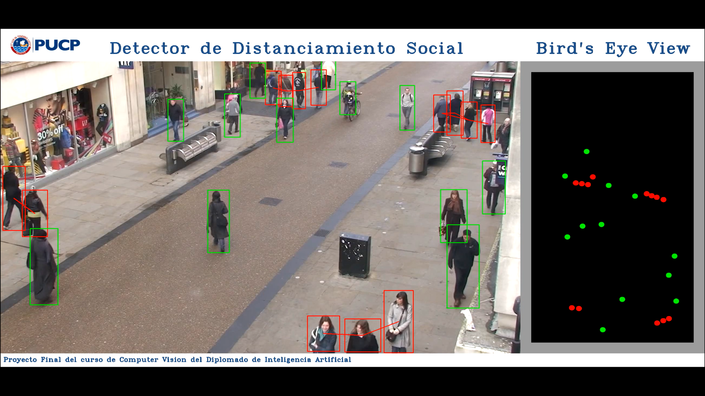

# Social Distance Detector

Proyecto Final de fin de curso de *_Desarrollo de Aplicaciones con Visión Artificial_* del Diplomado de Inteligencia Artificial de la PUCP.

## Objetivo 🚀

Este proyecto contiene una implementación para detectar en una imagen o en un video las personas que cumplen o no el distanciamiento social necesario que les ayudes a prevenir contagiarse del COVID-19.

<p align="center"> 
    
</p>

Video: https://www.youtube.com/watch?v=XxR2PXG9Zgk

## Procedimiento 🛠️

El proceso general para detectar el cumplimiento del distanciamiento social es el siguiente:

1. **Leer** un frame del video.
2. **Aplicar modelo CNN-Yolov3** para detectar los bounding box de las personas.
3. **Obtener los puntos de interés (puntos centro-inferior)** a partir de los bounding boxes generados.
4. **Mapear los puntos de interés hacia la vista Bird's Eye** utilizando la matriz de transformación de perpectiva pre-calculada. Se considera estos puntos puestos que son los que nos brindan la referencia de la ubicación de las personas desde una perspectiva top-down.
5. **Calcular todas las distancias entre los puntos transformados** para determinar en base a un threshold definido las personas que cumplen una distancia mínima requerida o no. 
6. **Mostrar los resultados**, se colorean de ROJO los que NO CUMPLEN, y en su defecto de VERDE a los que SÍ CUMPLEN.
7. **Repetir el proceso** para todos los frames en el video.


## Pre-Requisitos 📋

Este proyecto inicialmente ha sido diseñado para poder ser ejecutado en Colab y para una optimización se activó el entorno de ejecución en GPU.
Colab ya trae instaladas muchas de las librerías utilizadas en este proyecto, solo fue necesario descargar:
- yolov3.cfg 
- coco.names 
- yolov3.weights 

```
!wget "https://raw.githubusercontent.com/pjreddie/darknet/master/cfg/yolov3.cfg"
!wget "https://raw.githubusercontent.com/pjreddie/darknet/master/data/coco.names"
!wget "https://pjreddie.com/media/files/yolov3.weights"
```

## Archivos necesarios para la ejecución 🛠️

📌 **MODELOS:**

* **_models/yolov3-608_** : Carpeta con los archivos necesarios para levantar el modelo CNN-YOLO y realizar la detección de personas.

   - _yolov3.cfg_ : Configuración del Modelo de CNN-YOLO para la detección de objetos
   
   - _coco.names_ : Clases de objetos que detecta la red neuronal
   
   - _yolov3.weights_ : Pesos de la red neuronal

📌 **UTILITARIOS:**

* **_utils/functions.py_** : Utilitario con las funciones utilizadas durante todo el proceso central.

* **_utils/view.py_** : Utilitario con las funciones gráficas utilizadas para la generación de las vistas.

📌 **ARCHIVO PRINCIPAL:**

* **_Social Distance Detector.ipynb_** : Notebook con el desarollo y las pruebas end-to-end para detectar el cumplimiento del distanciamiento social

📌 **ARCHIVOS MULTIMEDIA:**

* **_multimedia/calibration_frame.jpg_** : Imagen

* **_multimedia/TownCentre-test.mp4_** : Video


## Proceso de Ejecución ⚙️ 

* Levantar el notebook principal en Colab
* Cargar los archivos necesarios al notebook
* Validar que el Tipo de Entorno de Ejecución está en **GPU**
* Ejecutar todo el notebook

## Documentación de apoyo 📚

Object Detection Algorithms: https://towardsdatascience.com/r-cnn-fast-r-cnn-faster-r-cnn-yolo-object-detection-algorithms-36d53571365e

Landing AI Creates an AI Tool to Help Customers Monitor Social Distancing in the Workplace: https://landing.ai/landing-ai-creates-an-ai-tool-to-help-customers-monitor-social-distancing-in-the-workplace/


## Autores ✒️

* **Jorge Rodríguez Castillo** - [Linkedin](https://www.linkedin.com/in/jorge-rodr%C3%ADguez-castillo/) - [Github](https://github.com/jjrodcast)
* **Keven Fernández Carrillo** - [Linkedin](https://www.linkedin.com/in/keven-fern%C3%A1ndez-carrillo-50b07aa2/) - [Github](https://github.com/KevenRFC)
* **David Fosca Gamarra** - [Linkedin](https://www.linkedin.com/in/davidfoscagamarra/) - [Github](https://github.com/DavidFosca)

## Licencia 📄

Este proyecto está bajo la Licencia **GNU General Public License v3.0** - mira el archivo [LICENSE.md](LICENSE.md) para más detalles.


